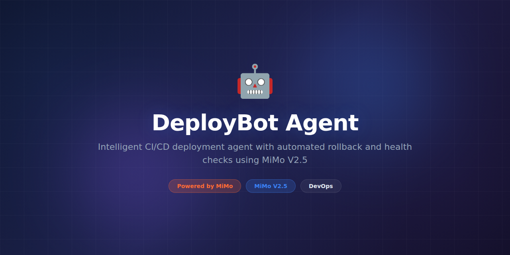

# DeployBot-Agent



> **Powered by MiMo** — built on top of Xiaomi's [MiMo](https://platform.xiaomimimo.com) reasoning models for intelligent CI/CD automation and deployment management.

[](https://opensource.org/licenses/MIT)
[](https://platform.xiaomimimo.com)

## Why MiMo

CI/CD pipelines are critical infrastructure, yet debugging them is a painful exercise in reading cryptic log output and guessing what went wrong. When a deployment fails at 2 AM, on-call engineers spend 30+ minutes parsing logs, checking configs, and triangulating root cause across multiple services. MiMo's reasoning models enable DeployBot-Agent to understand build and deployment failures, explain them in plain language, and propose or execute fixes automatically.

DeployBot-Agent uses MiMo to reason about the entire deployment context — it understands dependency graphs, infrastructure state, configuration drift, and recent changes to determine why a deployment failed and what the safest fix is. It can distinguish between a flaky test, a genuine regression, an infrastructure issue, and a configuration error, and respond appropriately for each.

The reasoning engine also powers intelligent deployment strategies. Instead of rigid blue-green or canary configurations, DeployBot-Agent monitors real-time metrics during rollouts and uses MiMo to reason about whether a deployment is healthy or should be rolled back. This adaptive approach catches subtle regressions that static thresholds miss.

## Token consumption

| Agent | Model | Tokens/run | Frequency | Daily/user |
|---|---|---|---|---|
| Failure Analyzer | MiMo-14B | 7,500 | Per failure | ~37,500 |
| Config Optimizer | MiMo-7B | 3,800 | Per deployment | ~19,000 |
| Health Monitor | MiMo-7B | 2,900 | Per rollout | ~14,500 |
| Rollback Advisor | MiMo-14B | 5,200 | On rollback | ~5,200 |
| Changelog Writer | MiMo-7B | 2,400 | Per deploy | ~12,000 |
| **Total** | — | **21,800** | — | **~88,200** |

## What it does

DeployBot-Agent is an AI-powered CI/CD assistant that monitors your build, test, and deployment pipelines. It diagnoses failures in real time, auto-generates fixes for common issues, monitors deployment health with adaptive rollouts, and maintains a complete audit trail with AI-generated changelogs. It integrates with GitHub Actions, GitLab CI, Jenkins, ArgoCD, and Kubernetes.

## Why this exists

Deployment failures are the #1 cause of unplanned downtime, and the mean time to recovery (MTTR) is dominated by diagnosis time, not fix time. Most failures have been seen before in slightly different form, but tribal knowledge is locked in Slack threads and individual engineers' heads. DeployBot-Agent captures that knowledge through reasoning, turning every failure into a learning opportunity that speeds up future resolutions.

## Features

- **Intelligent failure diagnosis** — reads build logs, test output, and infrastructure state to identify root cause
- **Auto-fix generation** — creates patches or PRs for common failure patterns (dependency conflicts, config errors, test flakes)
- **Adaptive rollouts** — monitors real-time metrics during canary/blue-green deployments with AI-driven decisions
- **Smart rollback** — detects subtle regressions and initiates rollback before users are impacted
- **Pipeline optimization** — analyzes build times and suggests parallelization, caching, and test sharding
- **AI changelogs** — generates human-readable changelogs from commit history and PR descriptions
- **Multi-platform support** — GitHub Actions, GitLab CI, Jenkins, ArgoCD, Helm, Kustomize
- **Slack/Teams integration** — contextual deployment notifications with failure summaries and fix suggestions
- **Audit trail** — complete history of every deployment decision with reasoning chains
- **Deployment scheduling** — maintenance windows, freeze periods, and approval workflows

## Tech Stack

- **Runtime:** Python 3.11+, Go (CLI tools)
- **AI Engine:** MiMo-7B and MiMo-14B via platform API
- **CI Platforms:** GitHub Actions API, GitLab CI API, Jenkins API
- **CD Platforms:** ArgoCD, Helm, Kustomize, plain Kubernetes manifests
- **Container Runtime:** Docker, containerd
- **Infrastructure:** Kubernetes client, Terraform (plan analysis)
- **API:** FastAPI with WebSocket for real-time streaming
- **Storage:** PostgreSQL (metadata, audit log), Redis (real-time state)
- **Messaging:** Slack SDK, Microsoft Teams webhooks
- **Testing:** pytest, pytest-asyncio

## Quickstart

```bash
# Clone and install
git clone https://github.com/nousresearch/DeployBot-Agent.git
cd DeployBot-Agent
pip install -e ".[dev]"

# Set your API key and tokens
export MIMO_API_KEY="your-key-here"
export GITHUB_TOKEN="ghp_..."

# Analyze a failed GitHub Actions run
deploybot analyze https://github.com/org/repo/actions/runs/12345

# Start the monitoring daemon
deploybot monitor --config config/production.yaml

# Generate a changelog for a release
deploybot changelog --repo org/repo --from v1.2.0 --to v1.3.0

# Watch a deployment with adaptive rollout
deploybot deploy --environment staging --strategy canary --watch

# Start the web dashboard
deploybot dashboard --port 3000
```

## Project Structure

```
DeployBot-Agent/
├── assets/
│   └── banner.png
├── deploybot/
│   ├── __init__.py
│   ├── cli.py                 # Command-line interface
│   ├── server.py              # API + WebSocket server
│   ├── monitor.py             # Pipeline monitoring daemon
│   ├── agents/
│   │   ├── failure_analyzer.py# Build/test failure diagnosis
│   │   ├── config_optimizer.py# CI/CD configuration advisor
│   │   ├── health_monitor.py  # Deployment health tracking
│   │   ├── rollback_advisor.py# Rollback decision engine
│   │   └── changelog_writer.py# AI changelog generation
│   ├── platforms/
│   │   ├── base.py            # Abstract CI/CD platform interface
│   │   ├── github.py          # GitHub Actions integration
│   │   ├── gitlab.py          # GitLab CI integration
│   │   ├── jenkins.py         # Jenkins integration
│   │   └── argocd.py          # ArgoCD integration
│   ├── deploy/
│   │   ├── strategies.py      # Canary, blue-green, rolling
│   │   ├── kubernetes.py      # K8s deployment management
│   │   └── metrics.py         # Deployment metric collection
│   ├── fixes/
│   │   ├── generator.py       # Auto-fix code generation
│   │   ├── templates/         # Common fix templates
│   │   └── applier.py         # Fix application (PR creation)
│   ├── notifications/
│   │   ├── slack.py           # Slack integration
│   │   └── teams.py           # Teams integration
│   └── utils/
│       ├── config.py          # Configuration management
│       └── logging.py         # Structured logging
├── config/
│   ├── production.yaml
│   └── development.yaml
├── tests/
│   ├── unit/
│   ├── integration/
│   └── fixtures/
├── Dockerfile
├── docker-compose.yml
├── pyproject.toml
└── README.md
```

## Contributing

Contributions are welcome! Please read our [Contributing Guide](CONTRIBUTING.md) before submitting a pull request.

1. Fork the repository
2. Create a feature branch (`git checkout -b feature/amazing-feature`)
3. Run the test suite (`pytest`)
4. Commit your changes (`git commit -m 'Add amazing feature'`)
5. Push to the branch (`git push origin feature/amazing-feature`)
6. Open a Pull Request

## License

This project is licensed under the MIT License — see the [LICENSE](LICENSE) file for details.

## Acknowledgments

- Built on top of [MiMo](https://platform.xiaomimimo.com) by Xiaomi
- Deployment strategies inspired by Flagger and Argo Rollouts
- Thanks to all [contributors](https://github.com/nousresearch/DeployBot-Agent/graphs/contributors)
